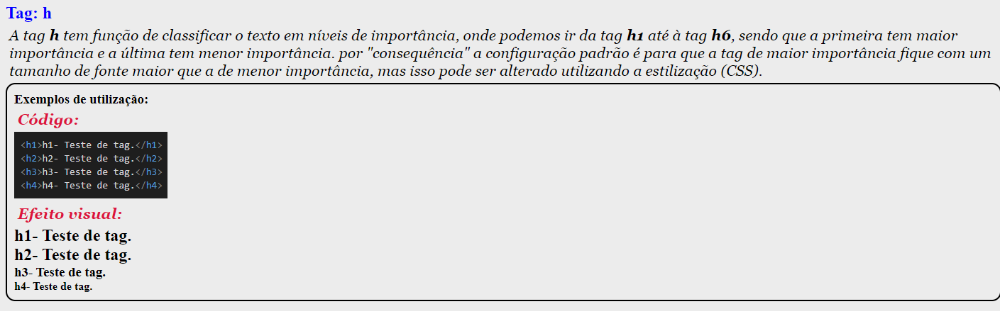

⚪🔴🟠🟡🟢🔵🟣🟤⚫⚪🔴🟠🟡🟢🔵🟣🟤⚫⚪🔴🟠🟡🟢🔵🟣🟤⚫⚪🔴🟠🟡🟢🔵🟣🟤⚫⚪
# _**Algumas tags do html 5**_
## _Esta é uma página que demonstra algumas tags básicas do **html 5** e a sua melhor forma de utilização_
⚪🔴🟠🟡🟢🔵🟣🟤⚫⚪🔴🟠🟡🟢🔵🟣🟤⚫⚪🔴🟠🟡🟢🔵🟣🟤⚫⚪🔴🟠🟡🟢🔵🟣🟤⚫⚪

## 🟢 Tags
* h1 - h6
* p
* br
* a
* img
* ul
* li

